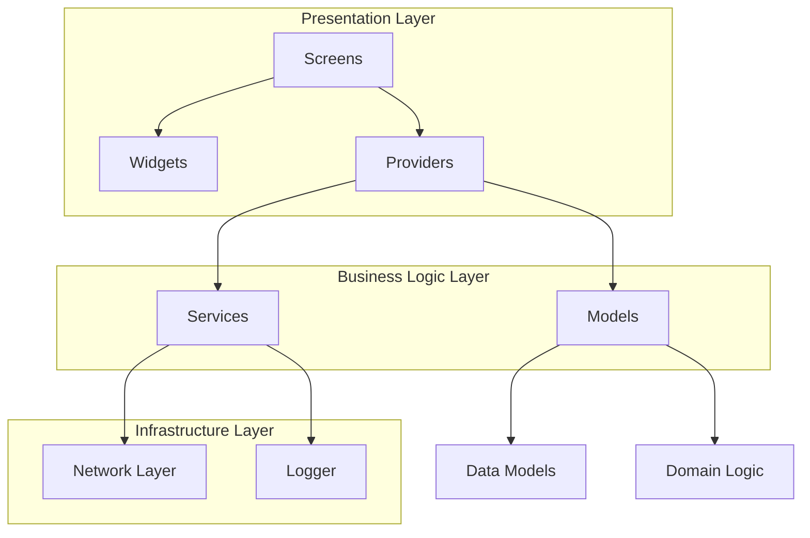
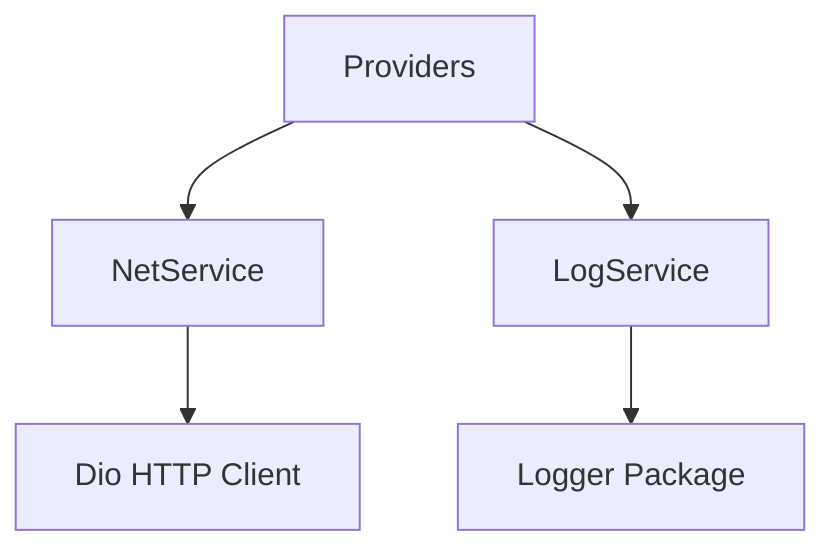
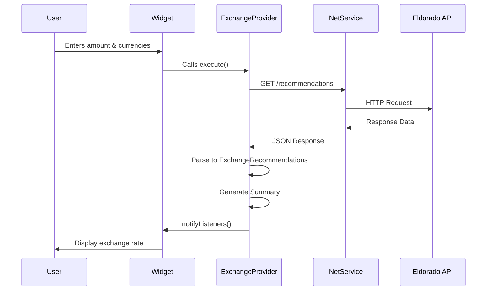

# Eldorado Challenge - Currency Exchange Calculator

A Flutter application that calculates exchange rates between cryptocurrencies and fiat currencies using real-time data from the Eldorado API.

## Tech Stack

- **Flutter SDK**: 3.35.2
- **Dart SDK**: 3.9.0
- **State Management**: Provider
- **HTTP Client**: Dio
- **Routing**: GoRouter
- **Logging**: Logger

## Getting Started

### Prerequisites

Ensure you have Flutter installed on your system. You can verify by running:

```bash
flutter --version
```

If Flutter is not installed, follow the [official installation guide](https://docs.flutter.dev/get-started/install).

### Installation

2. Install dependencies:
```bash
flutter pub get
```

3. Run the application:
```bash
flutter run
```

## Project Architecture

### Architecture Overview

The project follows a **modular, layered architecture** designed for scalability and maintainability:



### Folder Structure

```
lib/
├── core/                    # Shared resources across the app
│   ├── assets/             # Asset path constants
│   ├── config/             # App configuration
│   ├── models/             # Domain models
│   ├── providers/          # Base provider classes
│   ├── router/             # Navigation configuration
│   ├── services/           # Shared services (network, logging)
│   ├── theme/              # App theme and colors
│   └── widgets/            # Reusable widgets
│
├── modules/                # Feature modules
│   └── home/               # Home module (exchange calculator)
│       ├── providers/      # State management
│       ├── screens/        # Screen components
│       └── widgets/        # Module-specific widgets
│
└── main.dart               # App entry point
```

### Key Architectural Patterns

#### 1. Provider Pattern for State Management


- **BaseProvider**: All providers extend this base class for lifecycle tracking
- **ExchangeProvider**: Manages exchange rate state and business logic
- **HomeProvider**: Manages home screen animations and UI state

#### 2. Service Layer



- **NetService**: Centralized HTTP client configuration
- **LogService**: Centralized logging with environment-based levels

#### 3. Model Layer

The model layer is divided into:

- **Domain Models**: `CurrencyOption`, `ExchangeOffer`, `ExchangeRecommendations`
- **View Models**: `ExchangeRecommendationSummary` - UI-ready data abstraction
- **Utility Classes**: `CurrencyLimits`, `OfferMakerStats`

## Data Flow



## Key Features

### Exchange Rate Calculation

- Support for Crypto → Fiat and Fiat → Crypto exchanges
- Real-time rate fetching from Eldorado API
- Automatic limit validation (min/max amounts)
- Multiple offer recommendations (by price, speed, reputation)

### UI/UX Enhancements

- Smooth hero animations on app launch
- Currency swap animation with scale effects
- Bottom sheet for currency selection
- Real-time input validation
- Error handling with user-friendly messages
- Loading states during API calls

### Supported Currencies

**Cryptocurrencies:**
- USDT (Tron)
- USDC (Tron)

**Fiat Currencies:**
- ARS (Argentine Peso)
- BOB (Bolivian Boliviano)
- BRL (Brazilian Real)
- COP (Colombian Peso)
- PEN (Peruvian Sol)
- VES (Venezuelan Bolívar)

## API Integration

### Endpoint

```
GET https://74j6q7lg6a.execute-api.eu-west-1.amazonaws.com/stage/orderbook/public/recommendations
```

### Query Parameters

| Parameter | Type | Description |
|-----------|------|-------------|
| `type` | int | 0 = Crypto to Fiat, 1 = Fiat to Crypto |
| `cryptoCurrencyId` | string | Cryptocurrency identifier |
| `fiatCurrencyId` | string | Fiat currency identifier |
| `amount` | number | Amount to exchange |
| `amountCurrencyId` | string | Currency of the input amount |


## Code Quality

### Linting

The project uses Flutter's recommended lints with custom rules defined in `analysis_options.yaml`.

Run linter:
```bash
flutter analyze
```
